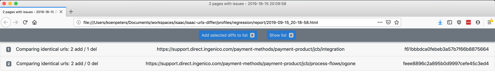
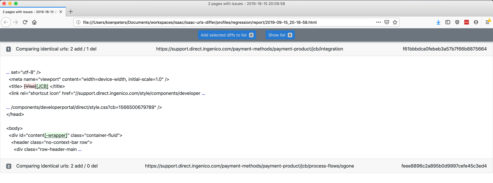
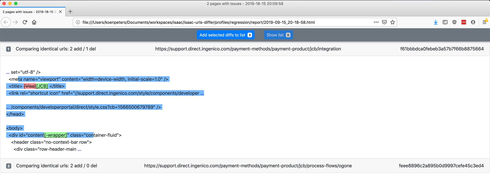
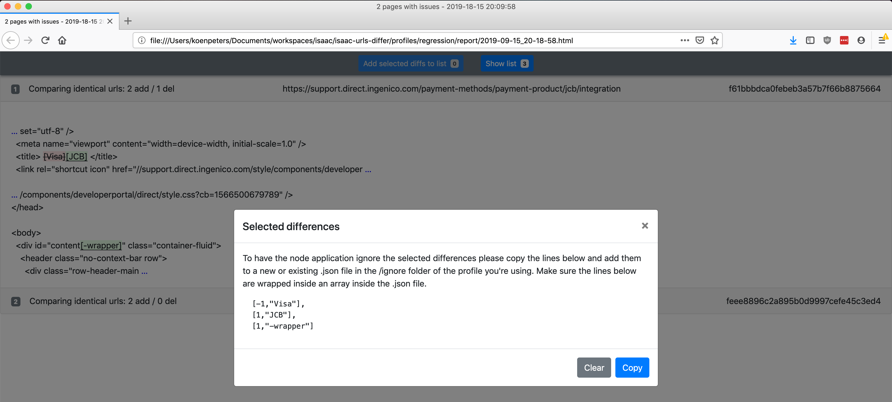

# Table of contents
- [Table of contents](#table-of-contents)
- [Introduction](#introduction)
- [Requirements](#requirements)
- [Profiles](#profiles)
- [How to run](#how-to-run)
- [Defining URLs](#defining-urls)
  - [Comparing a URL to itself](#comparing-a-url-to-itself)
  - [Comparing a URL to a different URL](#comparing-a-url-to-a-different-url)
- [The local cache](#the-local-cache)
- [The report file](#the-report-file)
- [Ignoring differences](#ignoring-differences)
- [FAQs](#faqs)
  - [How to reduce the number of parallel requests?](#how-to-reduce-the-number-of-parallel-requests)
  - [The report file is very large, how can I reduce the size?](#the-report-file-is-very-large-how-can-i-reduce-the-size)
  - [How are 404 responses handled?](#how-are-404-responses-handled)
  - [How are non 404 responses handled?](#how-are-non-404-responses-handled)

# Introduction

Fetch URLs and compare the content with local cached copies. See the differences in a nicely formatted report.

Only the page's content is compared, it does include referenced files in the comparison. For example: if the URL returns HTML then only the HTML itself is compared, not the referenced CSS, JavaScript, images, etc.

The differences will be nicely formatted in a report on disk. Minor differences like whitespace and formatting will be ignored. Additionally, you can specify which differences need to be ignored.



URLs can either be compared to themselves or to other URLs. 

# Requirements

1. At least node.js version 10.x

# Profiles

You can define multiple sets of URLs, called `profiles`, that are used separately.  When running the tool, you'll need to specify which profile you'd like to use.

All profiles are located in a subfolder of the `/profiles` folder in the root of the application. Each profile folder has its own urls, cache, ignore, and reports folder. 
```
profiles/
└── profile-name/
    ├── cache/
    ├── ignore/
    ├── report/
    ├── urls/
    └── config.json
```

The `/urls` folder contains all urls that should be fetched for this profile. The `/cache` folder contains the local copy of the content of these urls. The `/report` folder contains all generated reports and the `/ignore` folder contains all differences that should be ignored when comparing. Each profile also has a `config.json` file that allows you to tweak how the application should use the profile.

# How to run

Create a new profile with name `profile-name`. The folder will be created in the `/profiles` folder. 
```
node index -c profile-name
```

Run a comparison using profile `profile-name`.
```
node index profile-name
```

Run a comparison using profile `profile-name` and refresh its cache.
```
node index -r profile-name
```

# Defining URLs
The comparison will use all URLs defined in all files in a profile's `/urls` folder. All files in that folder must be valid URL definition files. A valid file is a json file that contains an array `[...]` of URL definitions.

There are two types of URL definitions that are used in two different situations:

## Comparing a URL to itself
Comparing a URL to a cached copy of itself allows you to check if a page has changed over time. This is useful when refactoring a live site to see if it is still up and is showing the same html. To compare a URL to itself simply define it as a string in the json file. 
```
[
    "https://some.domain.com/some/path",
    "https://some.domain.com/some/other/path"
]
```

## Comparing a URL to a different URL
Comparing a URL to another URL can, for instance, be useful when migrating sites. It allows you to see if a migrated page is the same as the original. To do this define a JSON object with the original URL as the value of property `oldUrl` and the new URL as the value of `newUrl`.
```
[
    {
        "oldUrl": "http://some.domain/some/path",
        "newUrl": "https://some.domain/some/other/path"
    },
    {
        "oldUrl": "https://some.domain/some/path2",
        "newUrl": "http://some.other.domain/some/path2"
    }
]
```

You can mix the two types of URL definition in one file if needed:
```
[
    "https://some.domain.com/some/path",
    {
        "oldUrl": "https://some.domain/some/path2",
        "newUrl": "https://some.other.domain/some/path2"
    }
]
```

# The local cache

To be able to do the comparison we need to cache a URL's page. This cache is stored in a profile's `/cache` folder. The folder name is the md5 hash of the URL itself.

You can update the local cache of a profile to the live version at any time by using the `-r` switch. Older caches are not deleted, but only the latest cache is used for comparing.

That folder contains a list of date folders: one for each time you requested the cache to be refreshed. The date folder has the date and time of the moment the refresh was executed. All URL folders have the same date and time folders unless a refresh was cancelled during execution. In that case only the folders of the urls that had already been fetched before the cancellation will have the new date folders.

In each date folder you'll find a metadata file that contains the URL that was fetched and an md5 hash of the page's content that was returned at that time. The folder also contains a reformatted version of the fetched html page.

You can completely delete a profile's cache folder. The next time the comparison for that profile is run a new cache will be created automatically.

# The report file

Only when differences are found during a comparison the system will create a new report.html file in the profile's `/report` folder. You can open the html file in a browser to see the differences per URL. 

The page shows a list of all pages for which differences were found. For each file in the list multiple things are shown:
1. The type of url comparison: `identical urls` or `different urls`
2. The type of difference: 
   1. `http 404`, which means the URL currently returns a 404 while it did not do that in the past. 
   2. The number of additions and deletions, for instance: 2 `add` / 1 `del`
3. The URL
4. The md5 hash of the URL. This is also the folder name for this URL in the `/cache` folder
5. When clicking on the file in the list the line will expand and show the actual difference: green for added text and red for deleted text.



# Ignoring differences

Sometimes differences are not relevant and clutter up the report. It's better to ignore these differences, which is managed using the profile's `/ignore` folder.

This folder contains files that contain an internal representation of all differences that should be ignored. This representation is tricky to manually edit due to HTML-escaping rules. This is why the generated report file has tooling to facilitate the creation of a list of differences to ignore.

To use it, open the `report.html` file in a browser and select the text that contains the irrelevant differences. Next click on the `Add selected diffs to list` button.



After having added all differences that you want to ignore click on the `Show list` button and copy the list to the clipboard. Paste it to a file and save that in the `/ignore` folder of the used profile. The next time the comparison is run these differences will no longer be shown in the report. 



Make sure the files in the `/ignore` folder all contain valid json. All rules must be inside a json array. For instance:
```
[
  [-1,"Visa"],
  [1,"JCB"],
  [1,"-wrapper"]
]
```

# FAQs

## How to reduce the number of parallel requests?

To speed things up, fetching of the URLs is parallelized using 8 different 'threads' by default. Make sure that the server can handle this load. If not reduce the number of 'threads' by changing the `nrOfParallelRequests` setting in the `config.json` file of a profile.

## The report file is very large, how can I reduce the size?

If the report file is very large it can take a long time to open the file in a browser. In such a case it's often a good idea to first only add a limited number of URLs to the `/urls` folder. Then run the comparison and open the resulting smaller report file. Add all irrelevant differences to a file in the `/ignore` folder and run the comparison again with all URLs. The resulting file will be much smaller since all irrelevant differences that occurred on all pages are now omitted from the report file.

## How are 404 responses handled?

When a fetched URL returns a 404 the application will retry up to 3 times. When the last try still returns a 404 the URL is marked as 404 and added to the report file. 


## How are non 404 responses handled?

When encountering a non 404 error when doing a request, the application will retry until it's successful. In between retries the system will wait for some time to allow the server to recover. The amount of time that is waited increases linearly with every attempt.
